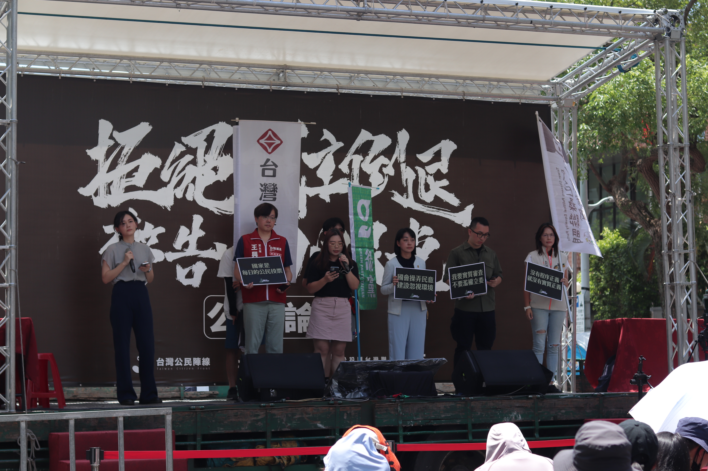

# 「反對提高門檻 沒收人民罷免權」聲援政黨聯合記者會

今日（21）社會民主黨、台灣綠黨、小民參政歐巴桑聯盟、時代力量、台灣基進等五個小黨，於立法院旁濟南路召開記者會，反對國民黨片面提高罷免門檻，剝奪人民的基本權利，削弱了公民的參政權和監督權。

時代力量黨主席王婉諭表示，罷免權是維護公共利益和監督政治人物的重要工具。她警告，提高罷免門檻將使罷免程序變得更加複雜和困難，實際就是剝奪民眾行使基本權利的機會，並阻礙公民有效監督政府的能力。

王婉諭強調，「還權於民」是時代力量的核心價值，呼籲所有關心民主發展的民眾共同反對任何妨礙罷免權的法案。台灣社會需要一個更加透明、公正和高效的罷免機制，確保公民對政治人物有效的監督。

社會民主黨召集人徐雍批評，中國國民黨與台灣民眾黨在國會中屢次破壞議事規則與慣例，透過眾多爭議法案引發國內紛擾、意圖為中國的入侵製造破口外，還想偷渡提高罷免門檻。民意代表的問政要公開透明、也須給人民監督制衡。提高罷免門檻，就是剝奪人民政治權利，失格立委應受到人民制衡。

徐雍說明，理想的民主機制，應是由代表社會不同聲音的小黨積極參與，讓法案公開透明充分討論、發揮社會正義並保障弱勢，人民能選出讓國家社會進步的民意代表，也應該能夠罷免背離民意的立委。

台灣綠黨共同召集人林裙靜說明，台灣綠黨作為全球綠人的一員，堅持「參與式民主」的核心價值。參與式民主強調的是每個人都有平等的發言權，所有公民都應該能夠參與到決策過程中來。我民主不僅僅是每隔幾年投一次票，它應該是人民持續參與公共事務、監督和影響政策的一種常態。因此，提高罷免門檻，實質上是在削弱人民持續參與和表達意見的權利，這是我們無法接受的。

林裙靜說，民主的核心就是人民的參與和監督，只有人民擁有足夠的權力，才能確保公共政策的制定和執行符合民意。為特定團體、特定政黨的利益去修改、提高罷免門檻，是對台灣民主社會的褻瀆與踐踏！選舉是公民權利、也是民意展現的管道，罷免也是。罷免權賦予公民監督、約束公職人員的能力。不管這個工具好不好用，他的使用權是掌握在公民手上、不是掌握在中國國民黨或是其他特定政黨手上！

小民參政歐巴桑聯盟副秘書長沈佩玲表示，這次的記者會不是針對某一個政黨而已，而是針對一種反民主的心態。我們針對的，是建立在地方派系、利益共生的選票基礎，看不見政治人物對理念的追求。所以，我們對罷免門檻的風吹草動，如此敏感。當我們看到立法委員一邊忙著擴大自己的調查權，一邊要限縮人民的罷免權，怎麼能不站出來大聲喝止。

台灣基進黨主席王興煥認為，國家是每日的公民投票，我們授權給代議士，不意味我們放棄國民與國家的契約本質。當公僕失職時，公民有開除公僕的權利，不容公僕擅自阻礙。罷免是民意約束國會議員的必要武器，震攝他們：公民並非開給立委一張「任你作威作福四年」的空白支票。

王興煥也要請教黃國昌對於罷免門檻態度，最初主張「有效票的同意票高於不同意票」即罷免成功。但後來的故事大家都知道，2017 年黃國昌罷免案，是因為用民進黨版本「同意票須超過選舉總人數 ¼」，他才諷刺地保住立委身分。王興煥要問現在與國民黨沆瀣一氣的黃國昌，關於罷免門檻，是維持初衷「同意票高於不同意票」即可？還是要繼續提高罷免的難度？

五個政黨一致強調，面對國民黨的濫權行為，公民將持續備戰，絕不退縮，確保台灣的民主制度不會因為一時的政治利益而倒退。未來的日子裡，五個政黨也將繼續為捍衛民主而奮鬥，呼籲全體公民一起為台灣的未來而努力。

媒體聯絡人：

台灣基進中央新聞部專員  姚其宏 0988-761-737

時代力量  張育慈 0910-158-414