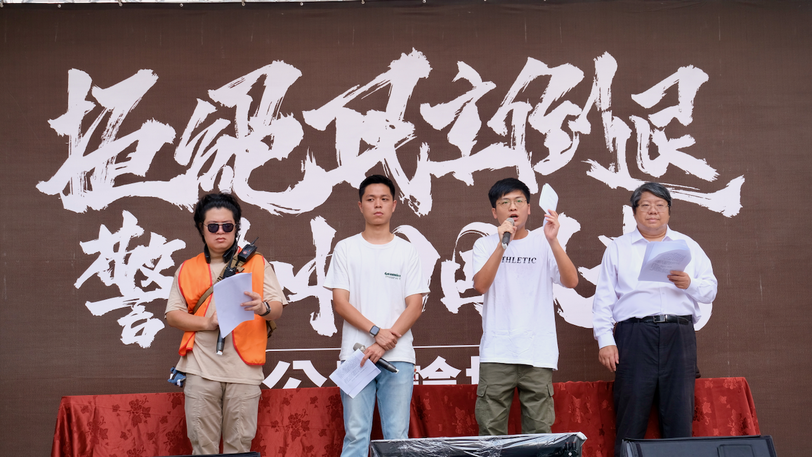

# 萬人集結，嚴厲警告國民黨！公民力量再度崛起，重返立法院

今（16）日上午 10 時，台灣公民陣線等團體於立法院外濟南路舞台舉行了開場記者會，揭開了為期三天的「公民反國會濫權，拒絕民主倒退，警告中國國民黨」行動序幕。此次行動由台灣公民陣線、經濟民主連合、公投護台灣聯盟等多個團體共同發起，保守估計將有破萬人參與，展現公民力量的再次集結。

## 青島東路白天：夏季學校課程啟動
經濟民主連合副祕書長許冠澤宣布了本次行動的重要安排——「民主台灣，夏季學校的」課程。這次街頭夏季學校旨在讓更多公民及學生在參與公民運動的同時，不忘深入思考與學習，進而了解台灣民主的歷史與現狀。夏季學校的歷史可追溯至 1924 年，由台灣文化協會創辦，當時的目的是對抗日本殖民政府的歧視和愚民政策，提升台灣人民的文化水平和民族意識。今日課程涵蓋的主題包括：陳方隅教授探討的「美中強權競逐與台灣民主」、林春元副教授講述的「台灣民主的危機與轉機」、林瓊華助理教授解析的「走出陽剛國家的民主陰影：轉型正義中的去除威權象徵之路」、以及李忠憲教授分享的「資安國安與資訊科技革命之後的反烏托邦」，呼籲已經放暑假的學生，可以來青島東路參加最有臨場感的民主課。

## 濟南路白天：拒絕民主倒退、警告中國國民黨 公民論壇
台灣公民陣線新北工作隊副隊長蕭任佑宣布了今天兩場公民論壇的安排。上午10:30 至 12:00 進行的論壇將聚焦於反對歸還救國團不當黨產，下午 14:00 至17:00 的論壇將集中討論反對中天紅媒重新上架，反對新聞台萬年執照，以及反對已擁有 NCC 委員同意權的立法院染指干涉行政院的提名權，破壞權力分立。這些論壇講者包括恒達法律事務所涂景亮實習律師、台灣青年法律人協會副秘書長黃亭偉、台灣青年法律人協會副理事長甘知沂、政治受難者呂昱，以及台灣媒體觀察教育基金會 洪貞玲、國立中正大學傳播學系助理教授張時健、台灣新聞記者協會 李志德等等傳播相關專家學者。

## 「公民反國會濫權，拒絕民主倒退」晚會流程揭曉
公投護台灣聯盟總召羅宜宣布了晚會的流程，包括涂景亮談濫權法案六大危害，許冠澤對中國國民黨提出七大警告，甘知沂討論不當黨產問題，羅承宗分析中天重新上架的影響，志工廖家瑜介紹地方工作隊的努力，賴中強談台灣民主危機及「全國八區，督藍委」的行動計劃。

他強調，上週公民陣線在板橋、淡水、基隆、新店、中永和等地舉辦的活動場場爆滿，民意不容忽視。羅宜指出、中國國民黨若在覆議案審查中再次背離民意，將面臨公民的強烈反擊。
公布藍營區域立委推動反民主法案之「惡人排行榜」

台灣公民陣線執委賴中強表示，在今日要審查覆議的國會濫權法案之外，台灣公民陣線志工組統計中國國民黨還要進一步推動成立國會特偵組，花東交通三條例，歸還救國團不當黨產，中天紅媒重新上架、新聞台萬年執照、國會染指 NCC 委員提名權，沒收人民罷免權，核電廠破格延役，反滲透法等民主防衛法制倒退撸修法等七大民主倒退法案，總共二十個法案(如附件一)。分析提案及聯署名單統計發現(如附件二)，全部四十一位藍營立委(含無黨籍高金素梅與陳超明)均參與提案或聯署，參與最少的副院長江啟臣也有兩案，參與最多的是牛煦庭、楊瓊瓔(16 案)，林思銘(15 案)  ，林沛祥、王鴻薇、羅智強、鄭正鈐(14案)，邱鎮軍、廖偉翔、羅廷瑋、陳雪生、黃仁(13 案)，賴士葆、張智倫、黃健豪、鄭天財(12 案)，涂權吉、顏寬恒、馬文君、游顥、陳玉珍(11 案)，我們要嚴厲警告這四十一位藍營區域立委，不要輕忽民意的反撲，只要這七大民主倒退法案在立法院有進一步推進，我們必將行動，台灣公民絕對不讓民主倒退。

立法院將於 6 月 19 日至 21 日對《立法院職權行使法》修法及《刑法》增訂藐視國會罪的覆議案進行審查，台灣公民陣線等團體再次號召群眾於立院外集 結，警告中國國民黨不要再次背離民意，堅決抵制民主倒退法案。這次行動將展示公民的團結與決心，確保台灣的民主不會倒退一步。

---

#### 【記者會資訊】
主辦：台灣公民陣線、台灣經濟民主連合、公投護台灣聯盟時間：2024 年 6 月 11 日上午九點

地點：立法院外濟南路舞台

主持：羅宜(公投護台灣聯盟總召，台灣公民陣線新北工作隊副隊長)

出席：許冠澤(台灣經濟民主連合副秘書長，新北工作隊副隊長兼基隆分隊隊長)蕭任佑(台灣公民陣線新北工作隊副隊長，新北青年公共事務協會理事長)賴中強(台灣公民陣線執委，經濟民主連合智庫召集人，新北工作隊隊長)

新聞聯絡人：許冠澤(經濟民主連合副秘書長 0988287108)