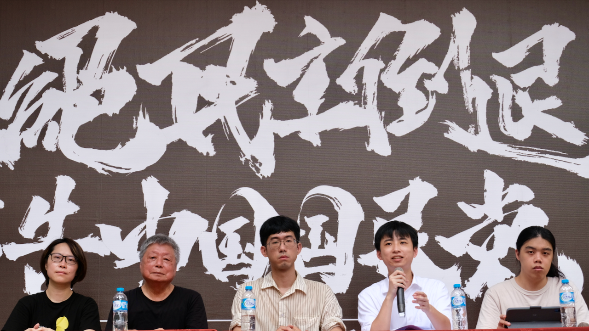

# 「不當黨產條例」修正案付委審查，轉型正義岌岌可危
**經濟民主連合、台灣青年法律人協會新聞稿**

中國國民黨立法委員游灝等人提出的《政黨及其附隨組織不當取得財產處理條例》（下稱「不當黨產條例」）修正案，於 6 月 14 日通過院會付委。此次修正案包括第 4 條第 2 款及第 34 條，旨在修改附隨組織的定義，將曾隸屬國家之組織排除在條例之外，並使此定義溯及既往，意在將原由「中國青年救國團」（下稱「救國團」）持有的不當黨產送回給救國團，修法救黨產。

數十年來，中國國民黨利用黨國一體的政府體系及威權統治，獲取土地、建物及財產，堆砌政黨利益、推動政黨發展。如今，「不當黨產條例」通過不到十年，中國國民黨再次試圖奪取這些財產，鞏固透過威權統治謀得之利益。

政治受難者呂昱前輩指出，蔣介石在台灣成立救國團，取代三民主義青年團，針對全台的學生進行思想控制，三民主義青年團很多成員也被抓走，不是因為他們不反共，而是因為他們不受蔣介石控制。這證明了救國團根本只是國民黨旗下的組織，深入校園、監控師生，包括校園教官都在救國團控制之中，顯然救國團就是附屬組織。

台中好民副理事長林芳如揭露，台中市國民黨黨部，因為不當黨產委員會，發現台中市國民黨部、市庫通黨庫，用台中市民的錢來買土地、蓋黨部，高達三億多。還好因為不當黨產條例，終於把這棟建築回歸市庫。甚至到了 1985 年，國民黨還召集台中市政府，要求市府各局處討論，由市府編列三千五百萬，讓國民黨黨部搬家。凡走過留下痕跡，黨外雜誌揭露，很多市民持續抗議、關心，才讓不當黨產委員會可以處理。大家應該反對救國團解套，因為救國團可能是占用各位市民的地，但是沒有受到相關的處理。該屬於國民的財產就該還給國民。

經濟民主連合、台灣青年法律人陣線對此修正案表達強烈抗議與不齒。處理不當黨產是轉型正義的重要歷程，其涉及人民及國家財產的保護與賠償、政黨間公平競爭的環境塑造、自由經濟市場的保護，以及法治國原則的落實。倘此修正案照案通過，可預見原屬於國家或一般人民，包括 13.9 億多元現金及 61 筆土地建物，將再次被中國國民黨收歸黨有。我們必須正告中國國民黨，停止掠奪國家人民財產，不要為強取豪奪找藉口！

> **涂景亮：不當黨產條例是為匡正過往違反自由民主憲政秩序狀態**

恒達法律事務所涂景亮實習律師說明，「不當黨產條例」係就非常時期違反自由民主憲政秩序及嚴重侵害基本權利之不法或不當過往，認於民主轉型之後有予以重新評價及匡正之必要而訂定。

涂景亮提出，有關「附隨組織」一併被規定進該條例的原因，在於過去威權體制時期，除特定政黨因黨國不分而不當取得之財產外，部分組織亦因與特定政黨有密不可分之關係，受特定政黨實質控制，而受有違反民主法治之財產，此部分自應一併納入，以避免藉脫法行為違反政黨政治之平等原則。

涂景亮強調，救國團之所以被認定為附隨組織，是因其實際上受中國國民黨在人事上、財務上、業務經營上三方面控制，而應該被共同重新評價。

就上開內容，司法院大法官第 793 號亦揭示，不當黨產條例立法目的在建立政黨公平競爭環境，以及匡正過往違反自由民主憲政秩序狀態，屬於「特別重要公共利益」。因此，立法者制定溯及既往之不利性法律規範，並非憲法所不允許，也不生信賴保護之問題。

涂景亮併同回應中國國民黨立委洪孟楷、游顥等認為不當黨產條例為「行政不當擴權」說法，司法院大法官第 793 號解釋揭明行政權有主動、積極、機動、全面之特質，與不當黨產條例所欲達成之目的任務相符，並未違反司法院大法官第 613、585 號解釋所揭櫫之最適功能理論及權力核心理論。

> **甘知沂：綜觀救國團歷史，無處不見中國國民黨實質影響力**

台灣青年法律人協會副理事長甘知沂說明，台灣的轉型正義直至民進黨政府上任後，於2016 年才看到「不當黨產條例」三讀通過。民進黨政府近年來於轉型正義所做自有其不足，然國民黨本次是大開轉型正義倒車，一舉將轉型正義退回修法前，為自己和附隨組織脫罪。

甘知沂回顧救國團歷史，說明救國團係國民黨為鞏固青年支持者，蔣介石頒布「中國青年反共救國團籌組原則」由行政院訓令國防部籌組，並指定蔣經國為第一任主任。「黨中央指揮行政院」形成在形式上隸屬國防部，實則為政黨附屬機構。救國團甚至在正式成立「之前」，就已是具有高度國民黨色彩的團體。

甘知沂舉例，自1952年透過國民黨中央改造委員會籌組成立，至1969年形式上解除與國防部的隸屬關係這段時間，救國團與國民黨之間絕對不能僅以「友好團體」來解釋。1961年國民黨八屆四中全會及296次中常會均將救國團組織改進及救國團的提案列入黨務工作報告書，甚至對於救國團召開青年代表會議的提案做出「准予備案」的決議。1962年國民黨各種黨部工作績效第九次綜合檢查總報告中，也將救國團列為「知識青年第九黨部」。甚至1966年，救國團還受邀到理應是機密會議的「中央心理作戰指導會報第123次會議中」，去專題報告「共匪一場『亡黨亡國亡頭』的大鬥爭」。然而這些也只是救國團與國民黨深度綁定的冰山一角，其中救國團所扮演的白色恐怖校園監控角色，更是令人感到憤怒。

甘知沂強調，並不是等到解除戒嚴之後，才有人開始反對救國團，其實在救國團成立之初的十年，由知識份子成立的《自由中國》刊物便自1952年起至1960年陸續撰寫批判救國團的存在，法制面作為法外黑機關缺乏法源依據、功能面與國民黨疊床架屋，並在財務面透過特殊關係網路掏空國家財政，並揭露救國團於1956年開始單年支出就達到台幣3億元左右。

甘知沂批評到，救國團在1969年透過國防部一紙公文，即解除從屬關係，然而救國團不僅沿用過去資產，亦在成為民間團體後，無償取得包含劍潭青年活動中心等建物、土地之產權與使用權。如此途徑一直都是救國團不當取得的財產來源，並且透過戒嚴時期的威權統治，使救國團得以併吞其他校園社團或青年組織，讓救國團辦理的活動得以壟斷台灣，進一步配合中國國民黨當局進行校園政治偵防，青年思想教育及海外對匪鬥爭工作等。救國團利用與中國國民黨密切關係，於特定領域佔盡特權，更進一步成為威權統治幫兇，如此行徑令人不齒。

> **黃亭偉：救國團實際受中國國民黨控制，坐實附隨組織與不當黨產之名。**

台灣青年法律人協會副秘書長黃亭偉說明，即便救國團曾隸屬於國防部，其實際運作仍由中國國民黨透過黨團指揮；與國防部分家後，中國國民黨持續透過救國團來鞏固青年與學生之國族與政黨認同，不使青年學生被競爭者或敵對者掌握。

據查，救國團在民國58年脫離國防部下設組織身份後，與僑委會共同出資興建劍青中心建物，然原屬救國團應自行出資部分，卻轉向教育部申請補助並通過；教育部之附帶條件為產權登記應依出資比例分配予教育部，然救國團進行產權登記時，卻將原屬教育部之產權登記於自己名下，等同是政府出資興建建案，贈與特定政黨附隨組織其產權與使用權，其實際價值至少可達三億元以上。

黃亭偉強調，是否曾隸屬政府並非不當黨產最根本的定義，而是其透過黨政關係，不當取得之國家與人民財產。如今游顥等中國國民黨立委提出之修正案規定，只要曾隸屬國家，即便有不當取得之實，亦可透過這層關係脫罪，不僅大開轉型正義倒車，更是明目張膽修改制度，將侵權行為合法化及合理化。

### 共同結論

經濟民主連合、台灣青年法律人協會在本次論壇最後，警告中國國民黨於不當黨產條例修正案之三大問題：

#### 一、破壞轉型正義進程，十年努力置若罔聞：

修正案將曾隸國家之組織排除於不當黨產條例之外，意圖將過去透過威權統治奪取的財產再次送回救國團，送回中國國民黨。如修正案通過，在黨國不分的歷史下，不當黨產條例將無法有效保障國家及人民財產！

#### 二、國民黨坐擁強奪而來的金山銀山，公平競爭、自由經濟市場毀壞：

修正案將導致原屬於國家或人民的財產，包括大量現金和土地建物，重新被救國團接納運用，即被中國國民黨收歸黨有。除了使國民黨得以持續透過有關資源鞏固與發展自身勢力，更損及國家及人民的財產權！

#### 三、黨政不分將被合理化，特權濫用令人髮指：

即使救國團曾隸國防部，實際上長期受到中國國民黨在財務、人事和業務經營上的控制，更於分家後持續透過不當手段取得財產。修正案合理化黨政不分問題，使濫用特權、違法亂紀取得之財產合法化！

我們堅決反對國民黨將黨產歸還救國團的修法提案。這不僅是對歷史正義的挑戰，也是對台灣民主法治的嚴重威脅。我們呼籲社會各界共同關注此事，維護轉型正義的成果，確保台灣民主進程不會因政黨利益而倒退，並鄭重呼籲立法院能夠嚴格把關，拒絕通過這一違反正義及法律原則的修法提案。

---

**【記者會資訊】**

主辦：台灣公民陣線、台灣經濟民主連合、台灣青年法律人協會

時間：2024 年 6 月 19 日上午10:30

地點：立法院外濟南路舞台

主持：台灣青年法律人協會副秘書長黃亭偉

出席：政治受難者呂昱前輩、台中好民副理事長林芳如、台灣青年法律人協會副理事長甘知沂、恒達法律事務所涂景亮實習律師

媒體聯絡人：甘知沂 0920103608