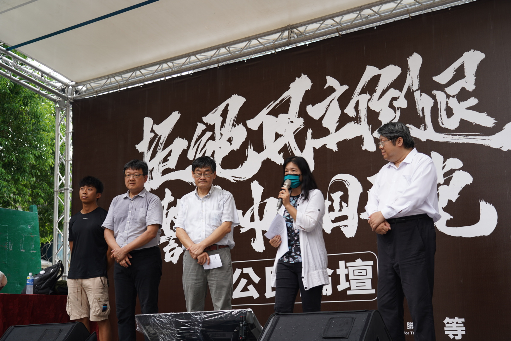

# 反中天重新發照公民團體聯合記者會聲明

國民黨提出多項媒體相關法案，包括中天復台、新聞台萬年執照、廢除黨政軍條款罰則以及修改NCC組織條例，改變委員選任辦法。這些法案，因人設事，將使新聞台不受約束，NCC委員選任走回違憲老路，我們期期以為不可！

我們反對中天復辟條款。可想而知，中天復辟條款是「為了一家中天要復辟，製造一堆袁世凱」。中天因為沒通過NCC六年一次的換照審查被下架了，國民黨卻提案強行以「持續經營」和「回溯條款」讓中天回到有線電視頻道，此舉完全紊亂法律原則，使得行政機關的處分無法發揮作用。旺中媒體長期罔顧新聞專業，亦引發萬人上街頭的反媒體壟斷、反紅媒運動，並遭NCC以違反事實查證原則多次開罰，最後不予換照。國民黨公然為特定電視台立案護航，毀棄法律原則，若這樣子可行，哪家媒體還需要遵守法律呢?

我們反對新聞台萬年執照。廣電媒體受到主管機關管理，各國皆然。而新聞台之表現良窳，涉及民主監督及發展的重要機制。英國政府對於新聞台違反公平正確原則祭出多項開罰，並取消中國環球電視網的執照；美國政府對於媒體高層涉入、新聞媒體蓄意造假，也會介入調查。新聞媒體負擔高度的社會責任，若失去對糟糕頻道的淘汰機制，未來，所有的電視新聞台，不管端出甚麼內容給閱聽人，大家只能無奈接受，因為執照永遠都是這些業者的。台灣享有高度的新聞自由，但是新聞公信力卻是每下愈況，如果NCC的換照審查權都被收回，只會放任新聞媒體各自發揮，完全無法保護閱聽人權益。而且這紙執照，未來極可能變成高價炒作目標，因為執照無確定期限，就是無限期保障現存秩序，讓壟斷的永遠壟斷。

我們反對刪除黨政軍條款罰則。國民黨提案刪除黨政軍條款的處罰對象，認為新聞媒體被動被投資，卻要遭受處罰，處罰對象錯誤。此提案表面看起來有其道理，但是在沒有配套的情況下，使得黨政軍條款完全沒有罰則。也就是說，未來政黨或政治人物想要插手媒體經營，將無法可管。廣電三法的黨政軍條款，包括禁止「政府、政黨、其捐助成立之財團法人及其受託人直接或間接投資媒體，禁止政黨黨務工作人員、政務人員及選任公職人員投資媒體，以及政府、政黨、政黨黨務工作人員及選任公職人員不得擔任媒體重要職務」，若刪除罰則，無異為政治勢力干預媒體敲開大門，台灣民主大幅倒退。

我們反對改變NCC委員選任方式。國民黨提案包括明定行政院和立法院皆有提名權，透過政黨比例制產生審查委員，並限制NCC在委員未過半數情形下不得將議案提付表決、委員總額過半數方得決議，這些提案的結果就是癱瘓NCC。大法官會議第613號解釋文已經述明，「基於權力分立原則，行使立法權之立法院對行政院有關通傳會委員之人事決定權固非不能施以一定限制，以為制衡，惟制衡仍有其界限，除不能牴觸憲法明白規定外，亦不能將人事決定權予以實質剝奪或逕行取而代之。NCC原有組織法的政黨比例制，經大法官會議解釋「實質上幾近完全剝奪行政院之人事決定權，逾越立法機關對行政院人事決定權制衡之界限，違反責任政治暨權力分立原則。」因此，NCC選任改採現行行政院提名，國會過半同意。國民黨擺明要提出違憲的法案，豈有此理! 

我們堅決反對上述四項提案，請國民黨不要憑藉和民眾黨的過半多數，提出毀憲違法、因人設事的法案，應回到憲政原理、法律原則思考，更重要的是，應以健全台灣新聞產業、保障閱聽人權益為己任。

- 台灣媒體觀察教育基金會 
- 媒體改造學社 
- 新台灣和平基金會 
- 台灣新聞記者協會 
- 台灣公民陣線
- 公民參與媒體改造聯盟
- 靖娟兒童安全文教基金會
- 台灣少年權益與福利促進聯盟

媒體聯絡人：賴麒全 0917441010

