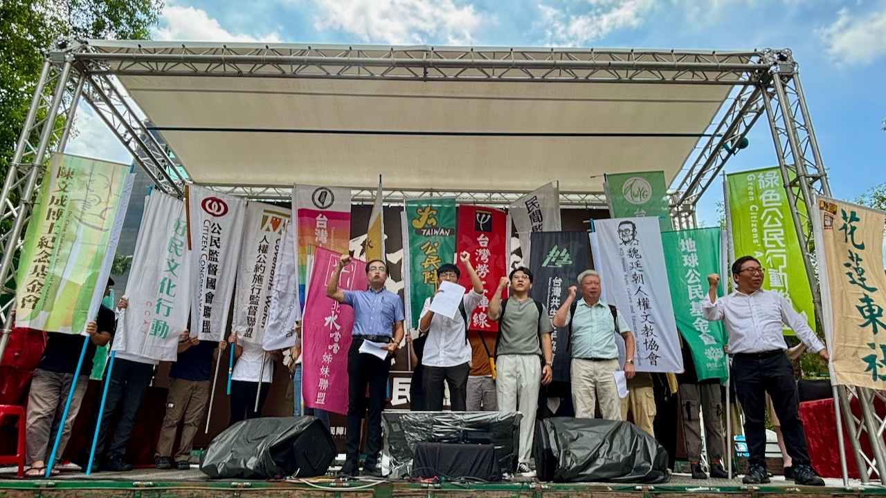

# 嚴正警告五位國民黨不分區立委，民意不可忽視

 

在炎熱的天氣和大雨之中，昨日（19）仍有數千名民眾堅定地現身立法院，反對國會濫權、民主倒退法案。今日（20），台灣公民陣線等50多個公民團體仍持續在立法院周邊舉辦夏季民主學院及公民論壇，呼籲民眾繼續參與，守護台灣的民主價值。經濟民主連合副秘書長許冠澤在記者會中，點名有意競選縣市長的五位國民黨立委，警告他們遲早將接受民意的考驗，不要再次背棄人民。

公民監督國會聯盟理事潘威佑說明，近期多家民調指出超過半數民眾支持行政院提出覆議案，顯見多數民眾希望立院能重新針對國會職權爭議修法進行討論。在野黨立委不該畫錯重點，民眾沒有反對國會改革，民眾反對的是沒有民主，且充滿程序重大瑕疵的審議過程！

潘威佑接續說道，立委身為人民公僕一年領上千萬的公帑，理當被人民好好監督，如今國民黨卻反過來叫公民團體「滾」！這是民主國家代議士該有的素質嗎？以抵制為藉口，逃避揭露立委兼職情況、辦公室經費使用情形，顯然相當不負責！如此傲慢行徑，未來也可能成為人民行使罷免權的重要理由之一！

魏廷朝人權文教協會秘書長莊秉璋表示，藍白推動多項民主倒退法案，不僅與世界主流價值背道而馳，也羞辱了過去戮力推動民主自由前輩。因此他與多個團體一同站出來守護民主，因為過去前輩們打下的民主根基不能被破壞，這是台灣這一代人的責任以及義務。

全球綠人台灣之友會理事陳彥廷說，花東三法不僅是錢坑法案，也是擴權法案。立法權與行政權分立，立法權制衡行政權，但是不能取而代之。憲法規定，立法院不能為增加預算之提議，這是常識。行政院用錢，立法院監督，全世界憲政國家體制共通的原理。今天，國民黨卻想用立法的方式，來決定某個時限之內，花費兩兆金額開訂單、搞建設，當然是擴權。台灣東社社長吳建銘怒批，花蓮是民主最前線，最近連計程車司機，都離開花蓮，將營運執照轉移到外縣市。因為沒有辦法相信傅崐萁花東交通三條例這種天馬行空的騙票建設，更何況法案中，所謂的引進國際「主權財富基金」，讓人質疑是要引進中共國營的主權財富基金。呼籲台灣人民與花蓮人一同守護台灣，同聲譴責這次的濫權法案。

台灣永社副主任黃慧瑜表示，明天就是表決日，永社希望呼籲國民黨、民眾黨兩黨重視行政院覆議帶來的機會，重新審視法案、進行修正，回應社會期待。另外，近期有許多重要法案，朝向不利台灣的方向修法，包括反滲透法和兩岸人民關係條例。希望台灣人民持續監督立法院的運作，確保所有立法行為符合民主程序、符合台灣的利益，才能共同維護民主的秩序。

許冠澤警告，五位有意競選縣市長的國民黨不分區立委，包括雲林縣的張嘉郡、嘉義縣的王育敏、台南市的謝龍介、高雄市的柯志恩和屏東縣的蘇清泉等人，不要以為不分區立委不會被罷免就罔顧民意。這五位立委有意挑戰縣市長選舉早是眾所皆知，他們遲早要受民意的檢視。

媒體聯絡人：許冠澤 0988287108

---

#### 附件【619-621公民反國會濫權，拒絕民主倒退，警告中國國民黨行動】合辦及聲援團體

**共同主辦團體包括：**
台灣公民陣線、台灣經濟民主連合、公投護台灣聯盟、社團法人華人民主書院協會、台灣基督
長老教會、財團法人陳文成博士紀念基金會、台灣教授協會、社團法人台灣民主實驗室、民間
監督健保聯盟、台灣共生青年協會、四二四教育基金會、全球綠人台灣之友會、台灣人權促進
會、台灣勞工陣線、社團法人台灣永社、社團法人台灣教師聯盟、台灣北社、台灣客社、台灣
社、台灣制憲基金會、新台灣和平基金會、北海岸反核行動聯盟、花蓮縣台灣東社、社團法人
台灣國、綠色公民行動聯盟、公民監督國會聯盟、好民文化行動協會、臺灣學生聯合會、地球
公民基金會、魏廷朝人權文教協會、台灣島永續發展協會、新北市謝聰敏教育基金會、人權公
約施行監督聯盟、新北市青年公共事務協會、台灣綠主張綠電生產合作社、鄭南榕基金會等。

**聲援團體：**
財團法人台北市蔡瑞月文化基金會、蕭靜文舞蹈團、財團法人彭明敏文教基金會、野薑花公民
協會、永和社大歷史小旅行工作隊、財團法人賴和文教基金會、台中市生活願景協進會、亞太
自由婦女協會、台灣南社、台中市全面罷免協會、惜根台灣協會、社團法人海線一家親環保協
會等。

**聲援政黨：**
台灣綠黨、時代力量、台灣基進、小民參政歐巴桑聯盟、社會民主黨。

---

#### 附件【五位有意競選市長的國民黨不分區立委所支持的提案以及數量

**台南市的謝龍介：** 花東交通三條例、歸還救國團不當黨產中天紅媒重新上架、新聞台萬年執照
、國會染指 NCC 委員提名權、沒收人民罷免權、核電廠破格延役，總計14案。

**屏東縣的蘇清泉：** 花東交通三條例、歸還救國團不當黨產中天紅媒重新上架、新聞台萬年執照
、國會染指 NCC 委員提名權、沒收人民罷免權、核電廠破格延役，總計14案。

**雲林縣張嘉郡：** 花東交通三條例、歸還救國團不當黨產、中天紅媒重新上架、新聞台萬年執照
、國會染指 NCC 委員提名權、沒收人民罷免權、核電廠破格延役，總計14案。

**高雄市的柯志恩：** 花東交通三條例、歸還救國團不當黨產中天紅媒重新上架、新聞台萬年執照
、國會染指 NCC 委員提名權、沒收人民罷免權、核電廠破格延役，總計9案。

**嘉義縣王育敏：** 花東交通三條例、中天紅媒重新上架、新聞台萬年執照、國會染指 NCC 委員
提名權、核電廠破格延役，總計8案。

**參與提案或連署合計 (共20案)**
| 警告順位 | 次數 | 地區           | 立委姓名 |
|----------|------|----------------|----------|
| 1        | 14   | 不分區／台南市 | 謝龍介   |
| 1        | 14   | 不分區／屏東縣 | 蘇清泉   |
| 1        | 14   | 不分區／雲林縣 | 張嘉郡   |
| 4        | 9    | 不分區／高雄市 | 柯志恩   |
| 5        | 8    | 不分區／嘉義縣 | 王育敏   |