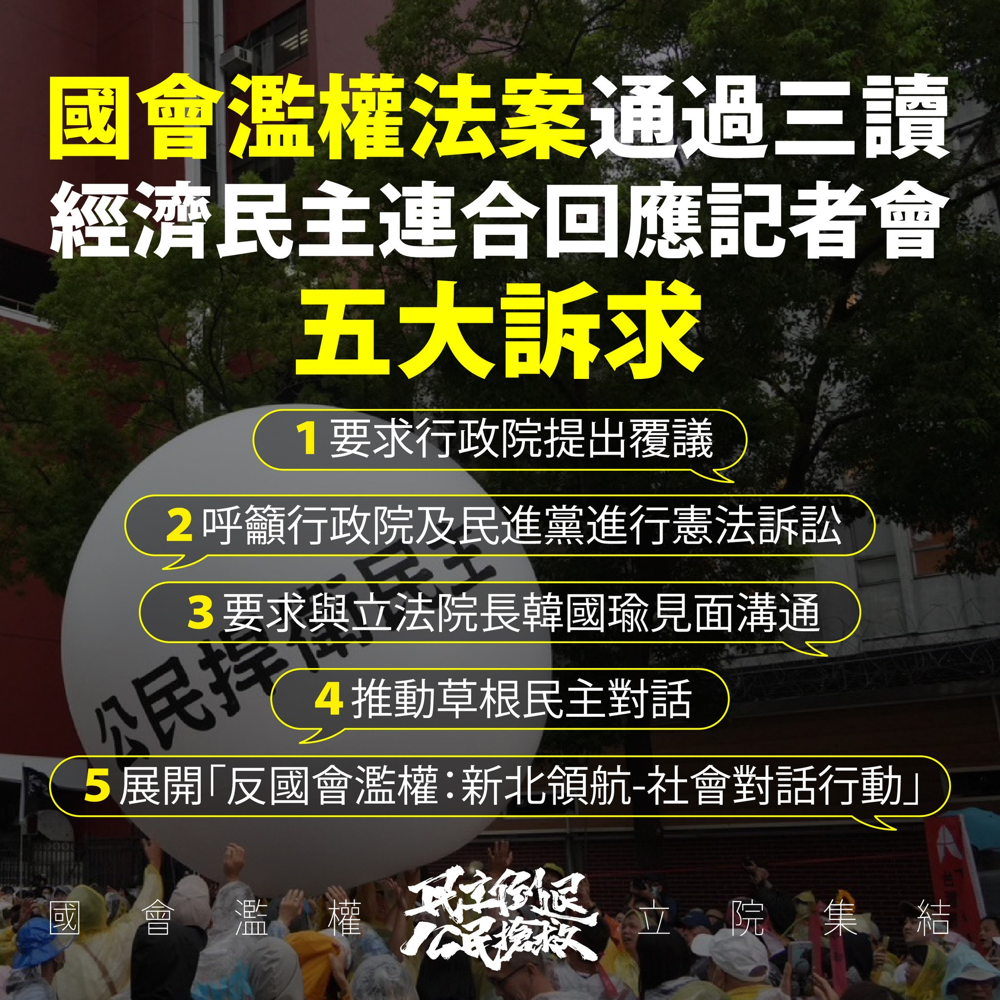

# 號召全台行動：草根民主對話、覆議重新表決
會後新聞稿

在立法院職權行使法三讀通過後，公民團體針對此程序不正義且實質違憲的法案，宣布了一系列回應行動，要求行政院提出覆議，讓立法院有重新檢討議決的空間。主辦單位並呼籲全台民眾發揮草根民主精神，積極參與、施壓濫權立委。 ​​記者會後，現場超過萬名集結的民眾共同將寫著「公民捍衛民主、重啟社會對話」的大球滾進立法院，將人民的聲音傳進立院。主辦單位並宣布，下週將拜訪行政院長、立法院長與立法院民進黨黨團。

首先，公民團體要求行政院提出覆議，讓立法院有重新檢討、議決的空間。經濟民主連合智庫召集人賴中強強調，行政院提出覆議並非要升高朝野對決，而是要讓正反雙方在看到完整條文後，再仔細思辨，充分溝通討論，彌補先前被藍白二黨沒收的委員會民主審議空間。

賴中強表示退回覆議及立法院重新決議的過程，可以讓藍白立委重新傾聽社會各界意見，了解所通過的法案是否破壞憲法權力分立，是否傷害人民的表意自由、個人隱私與營業秘密，是否違反大法官解釋所揭櫫的國會調查權界線與應以法律訂之的法律保留規範。

其次，賴中強指出，該法案中多項條文存在明顯的違憲疑慮，呼籲行政院及民進黨進行憲法訴訟。例如，總統國情報告後立委即問即答的規定，明顯違反憲法條文。立法院職權行使法第 25 條賦予立委的超級質詢權，讓個別立委可以強制官員甚至民間人士提供資料，也與調查權必須由立法院院會合議行使的原則相衝突。賴中強呼籲行政院或民進黨團依據憲法訴訟法提起法規範憲法審查，針對這些明顯違憲的條文進行訴訟。

第三、主辦單位也要求與立法院長韓國瑜見面，溝通立法院應遵守程序正義及國會透明。

關於公民行動，賴中強也宣布將推動「草根民主對話」，呼籲各地公民團體與自主公民在國民黨立委的選區舉辦社區座談，揭露國會濫權法案的所有內容及其對權力分立和台灣民主的傷害。我們將製作培訓教材、懶人包，並提供種子講師培訓，協助民眾深入了解法案真相，並在覆議案表決時對選區立委施加壓力。賴中強呼籲，濫權立委再不懸崖勒馬，公民將用選票制裁。

此外，賴中強也宣布，台灣公民陣線將前進新北市展開社會對話，組織成立新北工作隊，聯合在地青年組織、公民組織及本土小黨，共同針對新北市國民黨立委選區展開「反國會案濫權：新北領航——社會對話行動。新北市作為全國最大縣市，將成為此次行動的重點區域。

主辦單位呼籲全台組織起來、積極行動，揭露國會濫權法案的真相。台灣公民陣線將提供各項資料與教材，並與新北在地公民團體共同肩負在新北市的行動，共同為捍衛民主、維護人權而努力。

媒體聯絡人：
唐紋 Candia Tong 台港守護民主關注組 0965605503 (for Taiwanese and International Media)
Echo Lin 0935292293 (for International Media)

